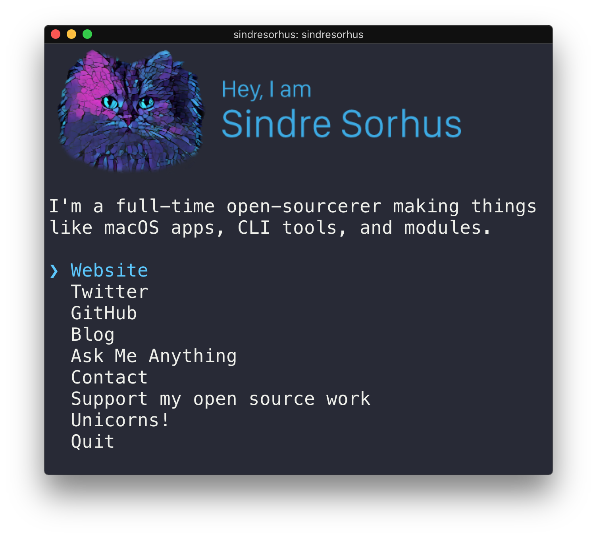

# vicentedealencar [](https://travis-ci.org/vicentedealencar/vicentedealencar)

> The [Vicente de Alencar](https://vicentedealencar.com.br) CLI




## Usage

Install Node.js, then:

```
$ npx vicentedealencar
```


## Built with

- [ink](https://github.com/vadimdemedes/ink) - React for interactive command-line apps
- [terminal-image](https://github.com/sindresorhus/terminal-image) - Display images in the terminal


## License

MIT © [Vicente de Alencar](https://vicentedealencar.com.br)
